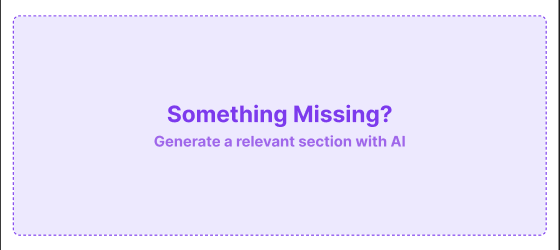

1. I have created a Figma design for my assignment. Please create a new AI Challenge section that matches my design. I will give you the requirements for this section. Please follow my instructions.
2. , PLACEHOLDER SECTION — AI CHALLENGE (10 Marks)
This is the only section where AI usage is expected and encouraged.

Replace the "Something Missing? Generate a relevant section with AI" placeholder with a brand-new section of your own idea.

The section must stay relevant to the DevConf 2026 theme (e.g. Sponsors, Venue, FAQ, Newsletter Signup, Hackathon Details, Past Highlights, Job Board, etc.).

Use AI (Claude, ChatGPT, or any tool) to help you ideate, design, and/or code this section.

Marks will be given based on:

How unique and creative the section idea is
How well it fits visually and thematically with the rest of the page
How effectively you used AI (clarity and quality of your prompting)
3. Give me some unique idea like Tech Stack
4. Wow! I like this Tach Stack idea. Please convert this idea into code with only basic HTML & CSS.
It should match my figma design exactly and be pixel-perfect.
5. Ok. I give you my other section HTML & CSS code that you measures in pixel-perfect 
6. Here is the HTML file (one of the section of my figma design that I have created):
<section class="speakers">
        <h1 class="section-title">Meet the Speakers</h1>
        

          

            
            
AI / ML

            <h3>Andrej Karpathy</h3>
            
Pretraining team, Anthropic

          

          

            
            
Cloud & DevOps

            <h3>Demis Hassabis</h3>
            
Co-Founder and CEO, Google DeepMind

          

          

            
            
Frontend

            <h3>Gary Marcus</h3>
            
Staff Engineer, Vercel

          

          

            
            
Security

            <h3>Mustafa Suleyman</h3>
            
CEO of Microsoft AI

          

        

      </section>
CSS file:
.speakers {
  margin-bottom: 50px;
}
.section-title {
  text-align: center;
  margin-bottom: 30px;
}
.speaker-grid {
  display: grid;
  grid-template-columns: repeat(2, 1fr);
  gap: 20px;
  max-width: 1200px;
  width: 90%;
  margin: 0 auto;
}
.speaker-card {
  background-color: white;
  padding: 10px;
  border-radius: 10px;
  box-shadow: 0 2px 2px rgba(0, 0, 0, 0.1);
}
.speaker-card img {
  width: 100%;
  height: auto;
  border-radius: 10px;
}
.speaker-card h3 {
  margin-top: 8px;
  color: #0d1b2a;
}
.speaker-card .speaker-blue-font {
  color: #1d4ed8;
  font-weight: 600;
  font-size: 10px;
  margin-bottom: 10px;
}
.speaker-card p {
  font-size: 14px;
  color: #575757;
  line-height: 1.4;
}

7. Add a icon for each h3 tag, also add more description in p tag & use this color "#0d1b2a" in each card for background color. please give me html & css code after my instruction
8. Add this line "Technologies You'll Explore at DevConf 2026" in h2 tag & also add this "Discover the most in-demand technologies featured throughout DevConf 2026 From AI and cloud computing to modern web development, every session is designed to help you build practical skills and stay ahead in the ever-changing tech industry." description in p tag
9. Remove the h1 tag "Tech Stack" in html
10. , text align center like this image
11. Give me full HTML & CSS code after you changed
12. Use all this color which you provided to each tech stack card icon & again give me full HTML & CSS code after you changed